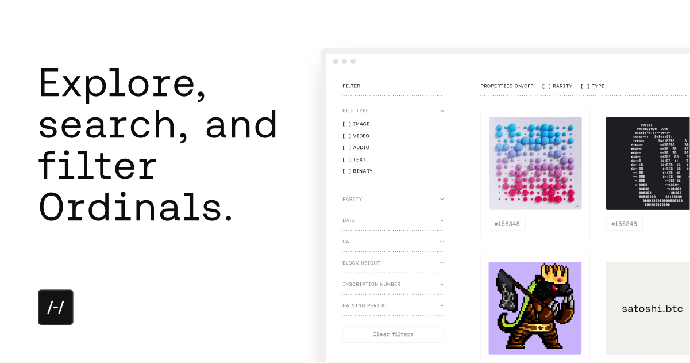

# Hiro Ordinals Explorer

➡️ https://ordinals.hiro.so 🌐



## Overview

The Ordinals Explorer is a Next.js (app router) project that uses the [Hiro Ordinals API](https://docs.hiro.so/ordinals).

There are two main parts of this project:

- The explorer `app/(explorer)` — A frontend for exploring ordinal inscriptions
- The preview API `app/(preview)` — An endpoint to render a specific ordinal inscription

## Development

```bash
cp .env.sample .env.local
```

```bash
npm install
```

```bash
npm run dev
```

Open [http://localhost:3000](http://localhost:3000) with your browser to see the result.
